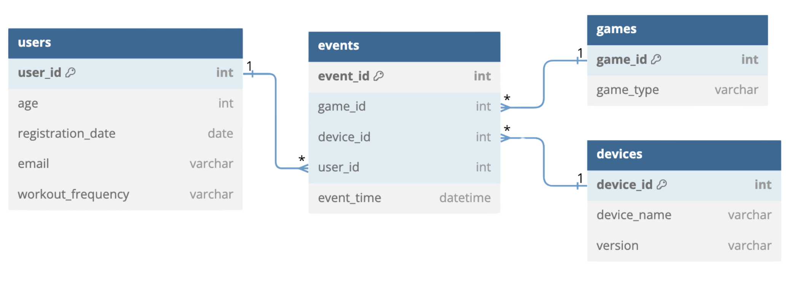

 

# Data Engineer Associate Exam - Virtual Reality Fitness

ActiVR provides a virtual reality device designed for exercise and fitness.

ActiVR offers a range of products, including VR devices and subscription-based fitness programs through their apps.

The sales team at ActiVR wants to analyze user data to enhance their marketing strategy and evaluate their products. For this, it is crucial that the data is clean, accurate, and available for reporting.

They need your assistance in preparing the data before launching a new promotional campaign.


**Database Schema**

The data schema for ActiVR's database is outlined as follows:

- **events:** Contains records of events registered in different games.
- **games:** Stores information about various games available on the platform.
- **devices:** Holds data about the virtual reality devices used by the users.
- **users:** Contains details about the users utilizing the ActiVR platform.

 

## Task 1

ActiVR's sales team wants to use the information it has about users for targeted marketing.

However, they suspect that the data may need to be cleaned before.

The expected data format and types for the `users` table according to the sales team's requirements is shown in the table below.

Write an SQL query that returns the `users` table with the specified format, including identifying and cleaning all invalid values. 
-  Your output should be a DataFrame with the name 'clean_data'. Do not modify the `users` table.
-  Note that the DataLab environment formats dates as YYYY-MM-DD-hh-ss-SSS. 


| Column Name     | Description                                                  |
|-----------------|--------------------------------------------------------------|
| user_id         | Unique integer (assigned by the database, cannot be altered). Missing values are not possible due to the database structure. |
| age             | Integer representing the age of the customer. Missing values should be replaced with the average age.                  |
| registration_date | Date when the user made an account first. Missing values should be replaced with January 1st 2024, using the appropriate format.   |
| email | Email address of the user. Missing values should be replaced with Unknown.  |
| workout_frequency        | Workout frequency as a lowercase string, one of: _minimal_, _flexible_, _regular_, _maximal_. Missing values should be replaced with _flexible_. |

```sql
--Just Full Schema Data Sample--
-------------------------------
SELECT
    e.event_id, e.game_id, e.device_id, e.user_id, e.event_time, u.age, u.registration_date, u.email, u.workout_frequency, g.game_type, d.device_name, d.version
FROM
    events e, users u, games g, devices d
WHERE
    e.user_id = u.user_id AND e.game_id = g.game_id AND e.device_id = d.device_id;
```
```sql
------------Task-1-------------
-------------------------------
SELECT 
    user_id,
    COALESCE(age, (SELECT ROUND(AVG(age)) FROM users WHERE age IS NOT NULL)) as age,
    COALESCE(registration_date, '2024-01-01') as registration_date,
    COALESCE(email, 'Unknown') as email,
    CASE 
        WHEN workout_frequency IS NULL THEN 'flexible'
        WHEN LOWER(TRIM(workout_frequency)) IN ('minimal', 'flexible', 'regular', 'maximal') THEN LOWER(TRIM(workout_frequency))
        ELSE 'flexible'
    END as workout_frequency
FROM users;
```

## Task 2
It seems like there are missing values in the `events` table for the column `game_id` for all events before the year 2021.

However, we know that before 2021 there were only games where the `game_type` is `running`. The `game_id` for these games can be found in the `games` table.

Write a query so that the `events` table has a `game_id` for all events including those before 2021.

-  Your output should be a DataFrame with the name 'events_with_game_id'. Do not modify the `events` table.

```sql
-------Task-2-----------
------------------------
SELECT
	e.event_id,
	e.user_id,
	e.device_id,
    e.event_time,
    CASE
        WHEN e.game_id IS NOT NULL THEN e.game_id
        WHEN CAST(SUBSTRING(e.event_time, 1, 4) AS INTEGER) < 2021 THEN (
            SELECT game_id
            FROM games
            WHERE game_type = 'running'
            LIMIT 1 )
    ELSE NULL END AS game_id
FROM events e
```

## Task 3

ActiVR's sales team plans to launch a promotion for upgrades to virtual reality devices.

They aim to target customers who have participated in events related to specific game types.

Write a SQL query to provide the `user_id` and `event_time` for users who have participated in events related to `biking` games.  Your output should be a DataFrame with the name  'event_biking'.

```sql
SELECT
	e.user_id,
	e.event_time
FROM events e
JOIN games g ON e.game_id = g.game_id
WHERE g.game_type = 'biking'
```

## Task 4

After running their promotion, the sales team at ActiVR wants to investigate the results.

To do so, they require insights into the number of users who participated in events for each `game_type`.

Write a SQL query that returns the count of unique users for each game type `game_type` and `game_id`. Entries with missing game types should be ignored. The user count should be shown in a column `user_count`. Your output should be a DataFrame with the name 'users_game'.

```sql
SELECT
    g.game_type,
    g.game_id,
    COUNT(DISTINCT e.user_id) AS user_count
FROM events e
JOIN games g ON e.game_id = g.game_id
WHERE g.game_type IS NOT NULL
GROUP BY g.game_type, g.game_id
```